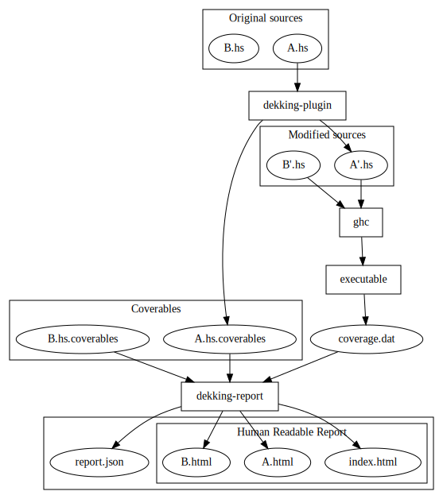

# Next-gen test coverage reports for Haskell

Dekking is a next-generation coverage report tool for Haskell.
It is implemented as a GHC plugin, as opposed to [HPC](https://hackage.haskell.org/package/hpc), which is built into GHC.


## Strategy

There are a few pieces of the puzzle.
The relevant programs are:

* `dekking-plugin`:
   Modifies the parsed source file within GHC as a source-to-source
   transformation plugin.
   At compile-time, this plugin also outputs a `.hs.coverables` file which
   contains information about which parts of the source file are coverable and
   where those pieces are within the source.
   The source is transformed such that, when compiled, the result will output
   coverage information in `coverage.dat`.
* `ghc`: Compiles the resulting modified source code
* `dekking-report`:
   Takes the `*.hs.coverables` files, and any number of `coverage.dat` files,
   and produces a machine-readable `report.json` file, as well as human
   readable HTML files which can be viewed in a browser.

### Source-to-source transformation

TODO: Write out how this works

### Coverables

Coverables are split up into categories:

* Top-level bindings
* Expressions

Each coverable comes with a location, which is a triple of a line number, a
starting column and an ending column.
This location specifies where the coverable can be found in the source code.

The `*.hs.coverables` files are machine-readable JSON files.

### Coverage

The `coverage.dat` files are text files with a line-by-line description of which pieces of the source have been covered.
Each line is split up into five pieces:

```
<PackageName> <ModuleName> <line> <start> <end>
```
For example:
```
dekking-test-0.0.0.0 Examples.Multi.A 4 1 5
```

### Strategy Overview



### Why a source-to-source transformation?

TODO

## Why not "just" use HPC?

* Strong nix support
* Multi-package coverage reports
* Coupling with GHC

TODO write these out
