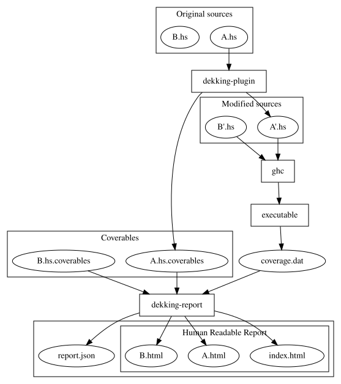

# Next-gen test coverage reports for Haskell

Dekking is a next-generation coverage report tool for Haskell.
It is implemented as a GHC plugin, as opposed to [HPC](https://hackage.haskell.org/package/hpc), which is built into GHC.

Current status: Used in Prod in all my products.

## Strategy

There are a few pieces of the puzzle.
The relevant programs are:

* `dekking-plugin`:
   Modifies the parsed source file within GHC as a source-to-source
   transformation plugin.
   At compile-time, this plugin also outputs a `.hs.coverables` file which
   contains information about which parts of the source file are coverable and
   where those pieces are within the source.
   The source is transformed such that, when compiled, the result will output
   coverage information in `coverage.dat`.
* `ghc`: Compiles the resulting modified source code
* `dekking-report`:
   Takes the `*.hs.coverables` files, and any number of `coverage.dat` files,
   and produces a machine-readable `report.json` file, as well as human
   readable HTML files which can be viewed in a browser.

### Source-to-source transformation

The source-to-source transformation works as follows;

We replace every expression `e` by `adaptValue "identifier for e" e`.
The identifier is generated by `dekking-plugin` at parse-time.

To give an idea of what this looks like, we would transform this
expression:

```
((a + b) * c)
```

into this expression (`f = adaptValue "identifier for e"`):

```
((f a) + (f b)) * (f c)
```

### The value adapter

The `adaptValue` function mentioned above is implemented in the very small `dekking-value` package, in the `Dekking.ValueLevelAdapter` module.

It looks something like this:

``` haskell
{-# NOINLINE adaptValue #-}
adaptValue :: String -> (forall a. a -> a)
adaptValue logStr = unsafePerformIO $ do
  hPutStrLn coverageHandle logStr
  hFlush coverageHandle
  pure id
```

This function uses the _problem_ of `unsafePerformIO`, namely that the IO is only executed once, as a way to make sure that each expression is only marked as covered once.

### Coverables

Each coverable comes with a location, which is a triple of a line number, a
starting column and an ending column.
This location specifies where the coverable can be found in the source code.

The `*.hs.coverables` files are machine-readable JSON files.

### Coverage

The `coverage.dat` files are text files with a line-by-line description of which pieces of the source have been covered.
Each line is split up into five pieces:

```
<PackageName> <ModuleName> <line> <start> <end>
```
For example:
```
dekking-test-0.0.0.0 Examples.Multi.A 4 1 5
```

### Strategy Overview



### Nix API

Nix support is a strong requirement of the `dekking` project.
A flake has been provided.
The default package contains the following `passthru` attributes:

* `addCoverables`: Add a `coverables` output to a Haskell package.
* `addCoverage`: Add a `coverage` output to a Haskell package.
* `addCoverablesAndCoverage`: both of the above
* `addCoverageReport`: Add a coverage `report` output to a Haskell package, similar to `doCoverage`.
* `compileCoverageReport`: Compile a coverage report (internal, you probably won't need this.)
* `makeCoverageReport`: Produce a coverage report from multiple Haskell packages.
  Accepts optional `threshold` (0-100) and `mustCover` (boolean, default `true`) arguments.
  Example usage:
  ``` nix
  {
    fuzzy-time-report = dekking.makeCoverageReport {
      name = "fuzzy-time-coverage-report";
      packages = [
        "fuzzy-time"
        "fuzzy-time-gen"
      ];
      threshold = 10; # Fail if coverage drops below 10%
    };
  }
  ```
* `requireCoverage`: Assert that a coverage report has covered expressions. Fails the build if no expressions were covered at all, which usually means tests are not running.
  Example usage:
  ``` nix
  {
    coverage-exists = dekking.requireCoverage {
      name = "my-coverage-exists-check";
      report = myCoverageReport;
    };
  }
  ```
* `assertCoverageThreshold`: Assert that a coverage report meets a minimum coverage percentage. Can be used standalone on any coverage report derivation.
  Example usage:
  ``` nix
  {
    coverage-check = dekking.assertCoverageThreshold {
      name = "my-coverage-check";
      report = myCoverageReport;
      threshold = 10;
    };
  }
  ```

See the `e2e-test` directory for many more examples.

### Why a source-to-source transformation?

TODO

### Why is there no separate coverage for top-level bindings, patterns, or alternatives?

Only expressions are evaluated, so only expressions can be covered.
Expression coverage also shows you alternative coverage because alternatives
point to an expression.
Top-level bindings are not somehow special either.
They are a code organisation tool that need not have any impact on whether
covering them is more important.

## Coverage thresholds

You can use `makeCoverageReport`'s `threshold` argument or `assertCoverageThreshold` to fail the build when coverage drops below a given percentage.
To fail the build when no expressions were covered at all (e.g. tests were accidentally turned off), use `mustCover = true` (the default) in `makeCoverageReport` or `requireCoverage` standalone.
See the Nix API section above for usage examples.

## Some part of my code fails to compile with coverage

Because of `RankNTypes` and limitations of `ImpredicativeTypes`, sometimes the source-transformed version of a function does not type-check anymore.
(See `[ref:ThePlanTM]`, `[ref:-XImpredicativeTypes]`, and `[ref:DisablingCoverage]`.)
A common example is Servant's `hoistServerWithContext`, see [ghc ticket 22543](https://gitlab.haskell.org/ghc/ghc/-/issues/22543).

There are three ways to selectively turn off coverage:

1. With an `--exception` for the plugin: `-fplugin-opt=Dekking.Plugin:--exception=My.Module`
2. With a module-level annotation: `{-# ANN module "NOCOVER" #-}`
3. With a function-level annotation: `{-# ANN hoistServerWithContext "NOCOVER" #-}`


## Why not "just" use HPC?

* Strong nix support
* Multi-package coverage reports
* Coupling with GHC

TODO write these out
